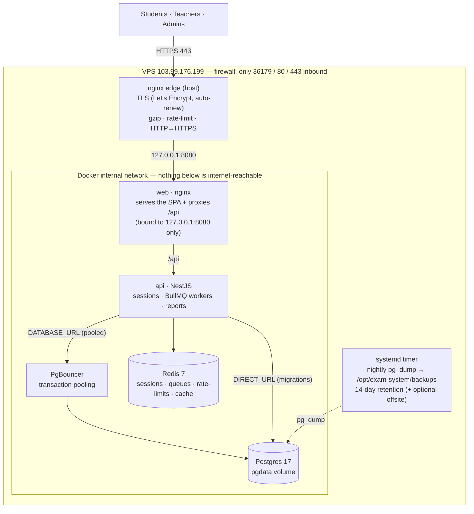

# Production Deployment — e-exam.ru.ac.bd

Complete, hardened, single-VPS deployment of the University of Rajshahi Examination System. This is
the exact, end-to-end process (every command, in order), the architecture, and the operations you'll
use afterwards. Following it on a fresh server reproduces the live deployment.

|                        |                                                                                     |
| ---------------------- | ----------------------------------------------------------------------------------- |
| **Domain**             | e-exam.ru.ac.bd → **103.99.176.199** (DNS A record already set)                     |
| **SSH**                | port **36179**, user `root` (key-only after § 1)                                    |
| **Repo**               | `https://github.com/omarfaruk16/exam-system.git` (public — the VPS pulls read-only) |
| **App path on server** | `/opt/exam-system`                                                                  |
| **OS**                 | Ubuntu/Debian                                                                       |

> Two commands mark **💻 your Mac** vs **🖥️ the server**. Your root password is needed only for the
> first two commands, then never again.

---

## 1 · Architecture



**Why this shape**

- **Only nginx is public** (80/443). The SPA/API container binds to `127.0.0.1:8080`; **Postgres,
  Redis and PgBouncer have no host ports at all** — the database is unreachable from the internet.
- **PgBouncer** pools DB connections (transaction mode) so many concurrent users share a small,
  stable set of Postgres connections. App queries use `DATABASE_URL` (pooled); Prisma **migrations**
  use `DIRECT_URL` (a real session), and run automatically when the API container starts.
- **Redis** holds sessions, BullMQ queues (reports/imports), rate-limit counters and caches
  (`appendonly` so it survives restarts).
- **TLS** via Let's Encrypt with automatic renewal. HSTS/CSP/security headers come from the app
  layer (Helmet + the web container's nginx); the edge preserves the `https` scheme so the API sets
  **secure, first-party session cookies**.

**"Load balancer" on one VPS:** the useful move is running the API on more CPU cores, not spreading
across machines — see § 9. The app keeps all state in Redis/Postgres, so it grows cleanly into a
true multi-node setup (add nodes + an external LB) later.

---

## 2 · Secure access (SSH keys, rotate the password)

**💻 Your Mac** — create a key (press Enter at every prompt) and install it (asks for the root
password once):

```bash
ssh-keygen -t ed25519 -C "exam-vps"
```

```bash
ssh-copy-id -p 36179 root@103.99.176.199
```

**💻 Your Mac** — log in with the key (no password now):

```bash
ssh -p 36179 root@103.99.176.199
```

**🖥️ The server** — set a new strong password, then disable password logins entirely:

```bash
passwd
```

```bash
sed -i 's/^#\?PasswordAuthentication.*/PasswordAuthentication no/' /etc/ssh/sshd_config; grep -rl 'PasswordAuthentication' /etc/ssh/sshd_config.d/ 2>/dev/null | xargs -r sed -i 's/^#\?PasswordAuthentication.*/PasswordAuthentication no/'; systemctl restart ssh 2>/dev/null || systemctl restart sshd
```

**💻 Verify from a second Mac terminal** — password login must be refused (`Permission denied (publickey)`):

```bash
ssh -p 36179 -o PreferredAuthentications=password -o PubkeyAuthentication=no root@103.99.176.199
```

---

## 3 · Get the code + harden the host

**🖥️ The server:**

```bash
mkdir -p /opt && cd /opt && git clone https://github.com/omarfaruk16/exam-system.git exam-system && cd exam-system
```

> If the folder already exists from a previous attempt: `cd /opt/exam-system && git fetch origin && git reset --hard origin/main` (leaves your gitignored `infra/.env` untouched).

One-time hardening — installs Docker, ufw firewall (opens **only 36179/80/443**), fail2ban,
automatic security updates, and swap. It opens the SSH port _before_ enabling the firewall, so you
can't be locked out:

```bash
SSH_PORT=36179 bash infra/scripts/harden-vps.sh
```

---

## 4 · Secrets

Copy the template and auto-generate the two secrets straight into it (no manual editing):

```bash
cp infra/.env.production.example infra/.env && SS=$(openssl rand -hex 64) && PW=$(openssl rand -base64 32 | tr -d '/+=') && sed -i "s|^SESSION_SECRET=.*|SESSION_SECRET=${SS}|" infra/.env && sed -i "s|^POSTGRES_PASSWORD=.*|POSTGRES_PASSWORD=${PW}|" infra/.env && chmod 600 infra/.env && echo done
```

Verify (does **not** print the secrets):

```bash
grep -qE "CHANGE_ME" infra/.env && echo "STILL HAS PLACEHOLDERS" || echo "secrets set OK"; grep -E "^(POSTGRES_DB|COOKIE_SECURE|CORS_ORIGINS|WEB_APP_URL)=" infra/.env
```

Expect `secrets set OK`, `POSTGRES_DB=exam_prod`, `COOKIE_SECURE=true`, and the two
`https://e-exam.ru.ac.bd` lines.

**Email (optional, for "Forgot password"):** edit `infra/.env` (`nano infra/.env`) and fill the SMTP
block — use your university mail server, or a Gmail account with a 16-char **App Password**:

```
SMTP_HOST=smtp.gmail.com
SMTP_PORT=587
SMTP_SECURE=false
SMTP_USER=youraccount@gmail.com
SMTP_PASS=your-app-password
MAIL_FROM=University Examination System <no-reply@ru.ac.bd>
```

Leave `SMTP_HOST` empty to disable email (reset links are written to the API log instead).

---

## 5 · Build and launch

```bash
docker compose -f infra/docker-compose.prod.yml --env-file infra/.env up -d --build
```

First build takes several minutes. Check health:

```bash
docker compose -f infra/docker-compose.prod.yml ps
curl -s http://127.0.0.1:8080/api/v1/health; echo      # {"status":"ok",...}
```

---

## 6 · Create the first super-admin

The production database starts empty. Create a single super-admin (no demo data). The script also
creates the role rows so this admin can then add other users from the UI.

```bash
docker cp apps/api/prisma/create-admin.ts exam_api:/app/apps/api/prisma/create-admin.ts
```

```bash
read -p "Admin email: " AE; read -s -p "Admin password (min 8): " AP; echo; docker exec -it -e ADMIN_EMAIL="$AE" -e ADMIN_PASSWORD="$AP" -e ADMIN_NAME="Super Admin" exam_api pnpm exec tsx prisma/create-admin.ts
```

Expect `✅ super_admin ready — email: … · created`. (Re-running with the same email just resets that
password.)

> _Alternative — full demo dataset instead of a single admin:_
> `docker exec -it exam_api pnpm exec tsx prisma/seed.ts` (creates faculties, courses, demo users
> `Admin@12345` / students `Student@123` — change all passwords afterwards).

---

## 7 · HTTPS (TLS certificate)

The full site config references certificate files that don't exist yet, so nginx won't start with
it. Get the certificate first with a temporary HTTP-only config, then switch to the full one.

**7a — install the shared pieces:**

```bash
cp infra/nginx/ratelimit.conf /etc/nginx/conf.d/exam-ratelimit.conf && mkdir -p /etc/nginx/snippets && cp infra/nginx/exam-proxy.conf /etc/nginx/snippets/exam-proxy.conf && rm -f /etc/nginx/sites-enabled/default && mkdir -p /var/www/certbot
```

**7b — temporary HTTP-only site so nginx can start:**

```bash
cat > /etc/nginx/sites-available/exam-system <<'EOF'
server {
    listen 80;
    listen [::]:80;
    server_name e-exam.ru.ac.bd;
    location /.well-known/acme-challenge/ { root /var/www/certbot; }
    location / {
        proxy_pass http://127.0.0.1:8080;
        include /etc/nginx/snippets/exam-proxy.conf;
    }
}
EOF
ln -sf /etc/nginx/sites-available/exam-system /etc/nginx/sites-enabled/exam-system
nginx -t && systemctl reload nginx
```

**7c — obtain the certificate** (answer the email + agree prompts):

```bash
certbot --nginx -d e-exam.ru.ac.bd
```

**7d — switch to the full config** (TLS + rate-limiting; the cert files now exist):

```bash
cp infra/nginx/host.conf /etc/nginx/sites-available/exam-system && nginx -t && systemctl reload nginx
```

**Verify end to end:**

```bash
curl -sI https://e-exam.ru.ac.bd | head -3; curl -s https://e-exam.ru.ac.bd/api/v1/health; echo
```

Expect `HTTP/2 200` and `{"status":"ok",...}`. Open **https://e-exam.ru.ac.bd**, log in as your
super-admin, and complete the one-time **2FA setup** (scan the QR with an authenticator app). Renewal
is automatic (`systemctl list-timers | grep certbot`).

---

## 8 · Automatic backups

```bash
cp infra/systemd/exam-backup.service infra/systemd/exam-backup.timer /etc/systemd/system/ && systemctl daemon-reload && systemctl enable --now exam-backup.timer && systemctl start exam-backup.service
```

Verify — one dump should appear, and the timer should be scheduled for 02:00:

```bash
ls -lh /opt/exam-system/backups/; systemctl list-timers | grep exam-backup
```

**Retrieve a backup to your Mac** (💻 run locally):

```bash
cd ~/Desktop/Web\ Dev/Project/exam-system && SSH_HOST=root@103.99.176.199 infra/scripts/pull-backup.sh ~/exam-backups
```

**Restore** (🖥️ ⚠️ replaces all current data):

```bash
cd /opt/exam-system && set -a && . infra/.env && set +a && POSTGRES_DB=exam_prod infra/scripts/restore.sh backups/exam_db_YYYYMMDD_HHMMSS.dump
```

**Offsite (recommended, 3-2-1):** install rclone, configure a remote, then add to
`infra/systemd/exam-backup.service` → `Environment=OFFSITE_CMD=rclone copy {} myremote:exam-backups`
and `systemctl daemon-reload`. Redis is not backed up (it's a cache/queue that rebuilds itself).

---

## 9 · Everyday operations

**Deploy an update** (edit locally → push to GitHub → on the server):

```bash
cd /opt/exam-system && bash infra/scripts/deploy.sh
```

Pulls `main`, rebuilds, runs DB migrations automatically, restarts — no data loss.

**Logs / status:**

```bash
docker compose -f infra/docker-compose.prod.yml logs -f api
docker compose -f infra/docker-compose.prod.yml ps
```

**More CPU cores (single-node scaling):** remove `container_name: exam_api` from the api service in
`infra/docker-compose.prod.yml`, then `up -d --scale api=3`. For nginx to balance across replicas,
switch the web container's `/api` proxy to a Docker-resolver upstream.

**Maintenance mode:** set `MAINTENANCE_MODE=true` in `infra/.env` and redeploy — the app returns 503
to everyone except health checks (useful during a big restore).

---

## 10 · Accounts & passwords

| How the account is made          | Initial password                                                              |
| -------------------------------- | ----------------------------------------------------------------------------- |
| `create-admin.ts` (§ 6)          | the password you chose                                                        |
| Seed (demo)                      | staff `Admin@12345`, students `Student@123`                                   |
| **Admin → Users → Create**       | random, not shown → user sets it via _Forgot password_, or use _Set password_ |
| **Admin → Users → Set password** | the password you type (user must change on first login)                       |
| **Org → add student**            | `Student@123` (must change on first login)                                    |
| **Bulk import (xlsx)**           | the `password` column if present, else random + email reset                   |

Staff (super_admin / admin / department_head / teacher) must enroll **2FA** on first login. Students
never do. "Forgot password" needs SMTP configured (§ 4) and the user to have an email address.

---

## 11 · Troubleshooting (issues already fixed in this repo)

These were hit and fixed during the first deployment; a fresh clone already contains the fixes.

- **`nginx -t` fails: `options-ssl-nginx.conf … No such file`** — the full config needs the cert.
  Use the § 7 order (temp config → certbot → full config).
- **`pnpm run seed` → "Missing script: seed"** — use `pnpm exec tsx prisma/seed.ts` (or
  `create-admin.ts`) inside the container instead.
- **Backup fails: `fe_sendauth: no password supplied`** — prod Postgres uses password auth; the
  scripts pass `PGPASSWORD` from `infra/.env` (fixed).
- **Login seems to work but 2FA/authenticated calls fail** — the web nginx must forward the edge's
  `X-Forwarded-Proto: https` so the API sets secure cookies (fixed in `infra/nginx/web.conf`).

---

## Security checklist

- [x] Root password rotated; **SSH key-only** (`PasswordAuthentication no`, verified refused).
- [x] Firewall: only **36179 / 80 / 443** inbound; fail2ban bans SSH brute-forcers.
- [x] **Postgres / Redis / PgBouncer have no host ports** — internet-unreachable.
- [x] Web bound to `127.0.0.1:8080`; only nginx faces the public.
- [x] **HTTPS** (auto-renewing cert); HSTS + CSP; secure, first-party cookies; 2FA for staff.
- [x] Strong generated `POSTGRES_PASSWORD` + `SESSION_SECRET`; `infra/.env` is root-only, not in git.
- [x] SCRAM-SHA-256 DB auth; app + edge rate limiting; automatic OS security updates; capped logs; swap.
- [x] Nightly backups — retained, retrievable, optional offsite.

```

```
