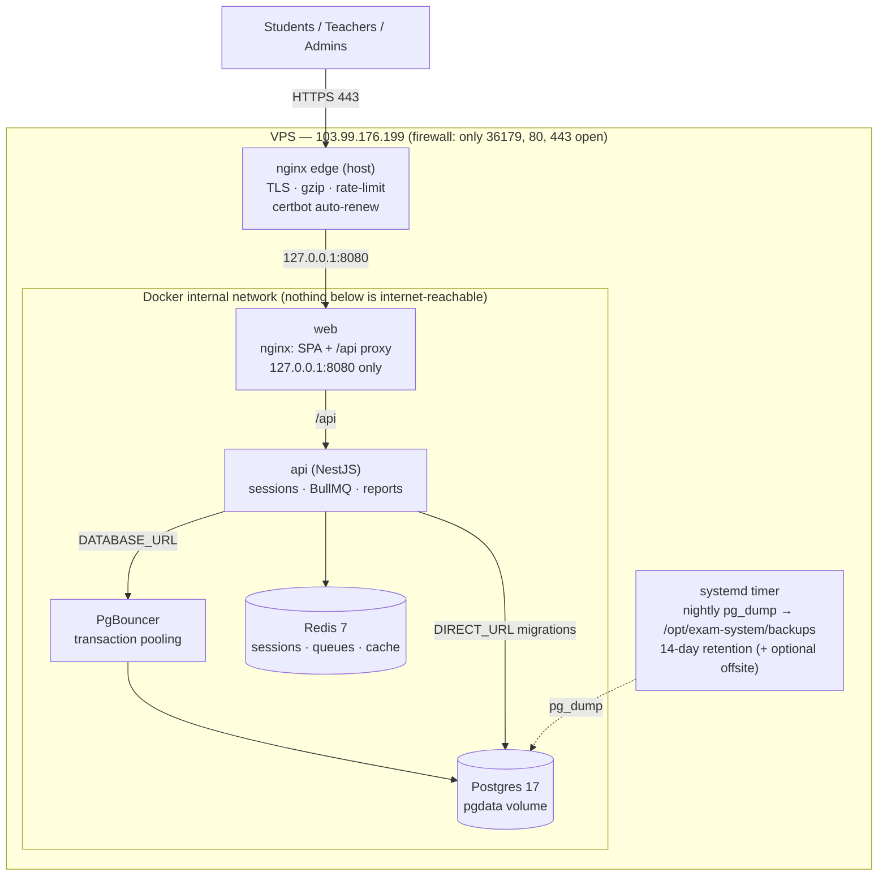

# Production Deployment — e-exam.ru.ac.bd

Hardened, single-VPS deployment of the University of Rajshahi Examination System. Everything runs
in Docker behind an nginx TLS edge; the database is never exposed to the internet; backups run
nightly and are easy to retrieve.

- **Host:** e-exam.ru.ac.bd (103.99.176.199) · **SSH:** port 36179 · Ubuntu/Debian, root.

> ⚠️ **The root password was shared in plain text — treat it as compromised.** § 1 switches you to
> SSH keys and rotates it. Do this before anything else.

---

## Architecture



**Why this shape**

- **Only nginx is public** (80/443). The SPA/API container binds to `127.0.0.1:8080`; Postgres,
  Redis and PgBouncer have **no host ports at all** — reachable only inside Docker.
- **PgBouncer** pools DB connections (transaction mode) so thousands of concurrent users share a
  small, stable set of Postgres connections — the real scaling win on one box. Prisma migrations
  use a **direct** connection (`DIRECT_URL`).
- **Redis** holds sessions, the BullMQ job queues (reports, imports), rate-limit counters and
  caches — `appendonly` so it survives restarts.
- **TLS** via Let's Encrypt (certbot) with automatic renewal. HSTS/CSP/security headers come from
  the app layer (Helmet + web nginx).

**On "load balancer":** on a single VPS the useful move is running the API on multiple CPU cores,
not spreading across machines. Default is one API container (plenty for a department). To use more
cores, scale it and let nginx round-robin — see § 6. True multi-node load balancing is a later
tier (add nodes + an external LB); the app is already stateless-friendly (state lives in
Redis/Postgres), so it grows into that cleanly.

---

## 1 · Security first — SSH keys, then rotate the password

**On your laptop** (skip keygen if you already have `~/.ssh/id_ed25519.pub`):

```bash
ssh-keygen -t ed25519 -C "exam-vps"
ssh-copy-id -p 36179 root@103.99.176.199
```

**Log in with the key**, then rotate the password and lock SSH down:

```bash
ssh -p 36179 root@103.99.176.199
passwd                       # set a NEW strong root password (the old one is compromised)
# Disable password logins entirely (key-only from now on):
sed -i 's/^#\?PasswordAuthentication.*/PasswordAuthentication no/' /etc/ssh/sshd_config
sed -i 's/^#\?PermitRootLogin.*/PermitRootLogin prohibit-password/' /etc/ssh/sshd_config
systemctl restart ssh || systemctl restart sshd
```

Keep this SSH session open and open a **second** terminal to confirm key login still works before
closing it (so a mistake can't lock you out).

---

## 2 · Harden the host + install prerequisites

Copy the repo up and run the one-time bootstrap (firewall, fail2ban, auto security-updates,
Docker, nginx, certbot, swap):

```bash
# On the VPS:
mkdir -p /opt && cd /opt
git clone <your-repo-url> exam-system    # or: rsync the project up
cd exam-system
SSH_PORT=36179 bash infra/scripts/harden-vps.sh
```

Firewall ends up: **only 36179 (SSH), 80, 443 inbound**; everything else denied. Review the script
first — it's short and commented.

---

## 3 · Configure secrets

```bash
cd /opt/exam-system
cp infra/.env.production.example infra/.env
# Generate strong secrets:
echo "SESSION_SECRET=$(openssl rand -hex 64)"          # paste into infra/.env
echo "POSTGRES_PASSWORD=$(openssl rand -base64 32 | tr -d '/+=')"   # paste into infra/.env
nano infra/.env
```

Set at least: `POSTGRES_PASSWORD`, `SESSION_SECRET`, and confirm `POSTGRES_DB=exam_prod`,
`CORS_ORIGINS`/`WEB_APP_URL=https://e-exam.ru.ac.bd`, `COOKIE_SECURE=true`. Keep `infra/.env`
**out of git** (it already is) and readable only by root: `chmod 600 infra/.env`.

---

## 4 · Deploy the app

```bash
cd /opt/exam-system
docker compose -f infra/docker-compose.prod.yml --env-file infra/.env up -d --build
```

This brings up Postgres, Redis, PgBouncer, the API (which runs `prisma migrate deploy` on boot),
and the web container on `127.0.0.1:8080`. Check health:

```bash
docker compose -f infra/docker-compose.prod.yml ps
curl -s http://127.0.0.1:8080/api/v1/health        # {"status":"ok",...}
```

**Seed once** (first deploy only — creates roles + the initial admin; skip on later deploys so you
never overwrite real data):

```bash
docker exec -it exam_api node apps/api/dist/prisma/seed.js   # path per your image; see package.json "db:seed"
```

> Change every seeded demo password immediately after first login.

---

## 5 · TLS + the public edge (nginx)

```bash
# On the VPS:
cp infra/nginx/ratelimit.conf  /etc/nginx/conf.d/exam-ratelimit.conf
mkdir -p /etc/nginx/snippets && cp infra/nginx/exam-proxy.conf /etc/nginx/snippets/exam-proxy.conf
cp infra/nginx/host.conf       /etc/nginx/sites-available/exam-system
ln -sf /etc/nginx/sites-available/exam-system /etc/nginx/sites-enabled/exam-system
rm -f /etc/nginx/sites-enabled/default
mkdir -p /var/www/certbot

nginx -t && systemctl reload nginx
certbot --nginx -d e-exam.ru.ac.bd          # issues the cert + wires HTTPS; auto-renews via timer
systemctl reload nginx
```

Visit **https://e-exam.ru.ac.bd** — you should get the login over a valid certificate. Renewal is
automatic (`systemctl list-timers | grep certbot`).

---

## 6 · Operations

**Redeploy after a code change** (pull, rebuild, migrations run on boot):

```bash
cd /opt/exam-system && git pull
docker compose -f infra/docker-compose.prod.yml --env-file infra/.env up -d --build
```

**Logs / status:**

```bash
docker compose -f infra/docker-compose.prod.yml logs -f api        # app logs (capped at 10m×5)
docker compose -f infra/docker-compose.prod.yml ps
```

**Use more CPU cores (single-node "load balancing"):** run N API replicas and let nginx
round-robin. Remove `container_name: exam_api` from the api service, then:

```bash
docker compose -f infra/docker-compose.prod.yml --env-file infra/.env up -d --scale api=3
```

For nginx to balance across replicas, switch the web container's `/api` proxy to a Docker-resolver
upstream (`resolver 127.0.0.11; set $u http://api:4100; proxy_pass $u;`). One replica is the
default and is fine for a department's load.

**Maintenance mode** (e.g., during a big restore): set `MAINTENANCE_MODE=true` in `infra/.env` and
redeploy the api; the app returns 503 to everyone except health checks.

---

## 7 · Backups — schedule, retrieve, restore

**Schedule (nightly 02:00, 14-day retention):**

```bash
cp infra/systemd/exam-backup.service /etc/systemd/system/
cp infra/systemd/exam-backup.timer   /etc/systemd/system/
systemctl daemon-reload
systemctl enable --now exam-backup.timer
systemctl start exam-backup.service          # run one now to verify
ls -lh /opt/exam-system/backups/             # exam_db_YYYYMMDD_HHMMSS.dump
systemctl list-timers | grep exam-backup     # confirm the schedule
journalctl -u exam-backup.service --no-pager # see the last run's log
```

**Get the backups onto your own machine** (run locally, uses your SSH key):

```bash
infra/scripts/pull-backup.sh ~/exam-backups              # newest dump
# or grab everything:
rsync -avz -e "ssh -p 36179" root@103.99.176.199:/opt/exam-system/backups/ ~/exam-backups/
```

**Offsite (recommended — 3-2-1 rule).** After a good local backup the script can push the dump
anywhere. Install rclone, configure a remote (S3, Google Drive, another server…), then add to
`infra/systemd/exam-backup.service`:

```
Environment=OFFSITE_CMD=rclone copy {} myremote:exam-backups
```

(`{}` is replaced with the new dump path.) Re-run `systemctl daemon-reload`.

**Restore a backup** (⚠️ drops & recreates the DB — all current data is replaced):

```bash
cd /opt/exam-system
POSTGRES_DB=exam_prod infra/scripts/restore.sh backups/exam_db_YYYYMMDD_HHMMSS.dump
```

Redis is not backed up (it's a cache/queue and rebuilds itself); only Postgres holds durable data.

---

## Security checklist

- [x] Root password rotated; **SSH is key-only** (`PasswordAuthentication no`).
- [x] Firewall: only **36179, 80, 443** inbound; fail2ban bans SSH brute-forcers.
- [x] **Postgres/Redis/PgBouncer have no host ports** — internet-unreachable.
- [x] Web bound to `127.0.0.1:8080`; only nginx faces the public.
- [x] **HTTPS** everywhere (auto-renewing cert); HSTS + CSP + secure, first-party cookies.
- [x] Strong generated `POSTGRES_PASSWORD` + `SESSION_SECRET`; `infra/.env` is root-only, not in git.
- [x] SCRAM-SHA-256 DB auth; app-level rate limiting + edge rate limiting; 2FA for staff.
- [x] Automatic OS security updates; capped container logs; swap to avoid OOM.
- [x] Nightly backups, retained + retrievable + optional offsite.
